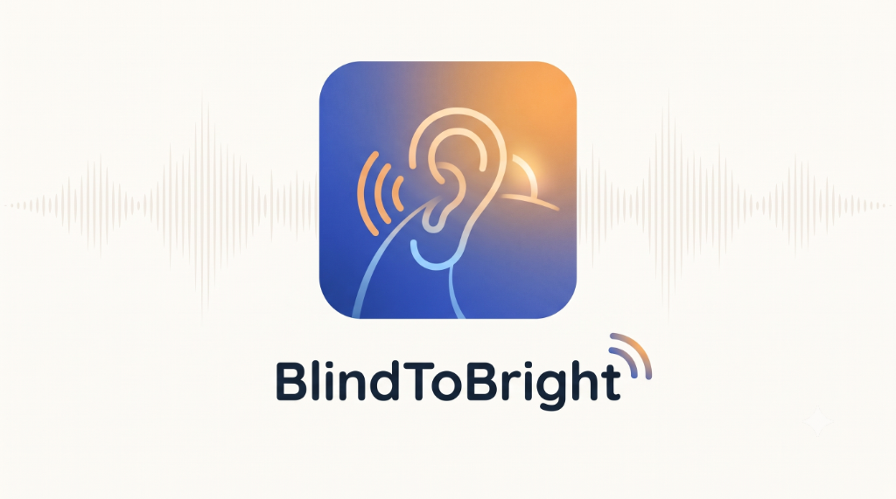
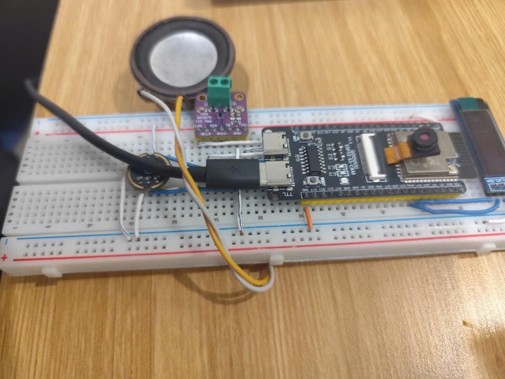
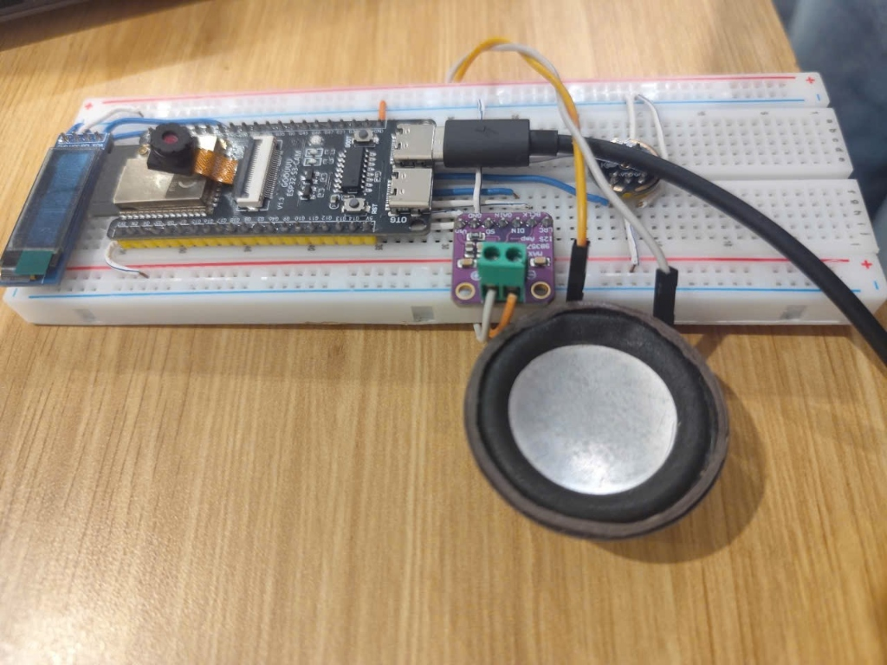

<p align="center">
  
</p>

<h1 align="center">BlindToBright</h1>

<p align="center">
  <b>Thiết bị giao tiếp 2 chiều thời gian thực cho người khiếm thính</b><br/>
  Vietnamese Sign Language (VSL) ↔ Tiếng Việt tự nhiên
</p>

<p align="center">
  
  
  
  
  
</p>

---

## Mục Lục

- [1. Tổng Quan Dự Án](#1-tổng-quan-dự-án)
- [2. Kiến Trúc Hệ Thống](#2-kiến-trúc-hệ-thống)
- [3. Phần Cứng (Hardware)](#3-phần-cứng-hardware)
- [4. Cài Đặt Phần Mềm (Software)](#4-cài-đặt-phần-mềm-software)
- [5. Cấu Hình](#5-cấu-hình)
- [6. Nạp Firmware ESP32](#6-nạp-firmware-esp32)
- [7. Chạy Chương Trình](#7-chạy-chương-trình)
- [8. Phím Tắt Điều Khiển](#8-phím-tắt-điều-khiển)
- [9. Tham Số Dòng Lệnh](#9-tham-số-dòng-lệnh)
- [10. Cấu Trúc Thư Mục](#10-cấu-trúc-thư-mục)
- [11. Kiến Trúc Mô Hình AI](#11-kiến-trúc-mô-hình-ai)
- [12. Xử Lý Sự Cố (Troubleshooting)](#12-xử-lý-sự-cố-troubleshooting)
- [13. Video Demo](#13-video-demo)

---

## 1. Tổng Quan Dự Án

**BlindToBright** là thiết bị hỗ trợ giao tiếp **2 chiều thời gian thực** giữa người khiếm thính (câm/điếc) và người bình thường:

| Chiều | Luồng xử lý | Đầu ra |
| :--- | :--- | :--- |
| **① Ký hiệu → Lời nói** | Người khiếm thính làm cử chỉ tay trước camera → AI nhận diện chuỗi từ VSL → Gemini AI ghép câu tiếng Việt tự nhiên → TTS đọc ra loa | 🔊 Loa ESP32 phát giọng nói + 📺 OLED hiện chữ `SIGN: ...` |
| **② Lời nói → Chữ** | Người bình thường nói vào micro → Gemini AI nhận dạng giọng nói (STT) → Chuyển thành văn bản tiếng Việt | 📺 OLED hiện chữ `MIC: ...` để người khiếm thính đọc |

### Công Nghệ Sử Dụng

- **Mô hình nhận dạng cử chỉ**: CTR-GCN (Channel-wise Topology Refinement Graph Convolutional Network)
- **Trích xuất xương khớp**: MediaPipe Holistic (76 điểm: 33 pose + 21 tay trái + 21 tay phải + 1 cổ)
- **AI Cloud**: Google Gemini API (LLM ghép câu + STT nhận diện giọng nói + TTS tổng hợp giọng nói)
- **Phần cứng nhúng**: ESP32-S3 (Camera OV2640 + Micro INMP441 + Loa MAX98357A + OLED SSD1306)

---

## 2. Kiến Trúc Hệ Thống

```
┌─────────────────────────────────────────────────────────────────────┐
│                        LAPTOP (Python App)                         │
│                                                                     │
│   ┌──────────────┐    ┌──────────────┐    ┌──────────────────────┐  │
│   │  Camera Feed │───▶│  MediaPipe   │───▶│ CTR-GCN Model        │  │
│   │  (Port 81)   │    │  Holistic    │    │ (Nhận diện cử chỉ)   │  │
│   └──────────────┘    └──────────────┘    └─────────┬────────────┘  │
│                                                     │               │
│                                           ┌─────────▼────────────┐  │
│                                           │  Gemini LLM          │  │
│                                           │  (Ghép câu tiếng     │  │
│                                           │   Việt tự nhiên)     │  │
│                                           └─────────┬────────────┘  │
│                                                     │               │
│                                  ┌──────────────────┼───────────┐   │
│                                  │                  │           │   │
│                          ┌───────▼──────┐  ┌───────▼────────┐  │   │
│                          │ Gemini TTS   │  │ Gửi text OLED  │  │   │
│                          │ (Giọng đọc)  │  │ (SIGN: ...)    │  │   │
│                          └───────┬──────┘  └───────┬────────┘  │   │
│                                  │                 │           │   │
│   ┌──────────────┐               │                 │           │   │
│   │  Mic Stream  │──▶ Gemini STT ──▶ Gửi text OLED (MIC: ...) │   │
│   │  (Port 82)   │    (Nhận dạng      ─────────────────────────┘   │
│   └──────────────┘     giọng nói)                                   │
└──────────┬──────────────────────────┬──────────────────────────┬────┘
           │ HTTP                     │ HTTP POST                │ HTTP POST
           │ Stream                   │ /oled                    │ /play
           ▼                          ▼                          ▼
┌─────────────────────────────────────────────────────────────────────┐
│                     ESP32-S3 (Phần cứng nhúng)                     │
│                                                                     │
│  📷 Camera OV2640    📺 OLED SSD1306    🎤 Mic INMP441    🔊 Loa   │
│  (Port 81 /stream)   (Port 80 /oled)   (Port 82 /mic)   MAX98357A │
│                                                          (Port 80  │
│                                                           /play)   │
└─────────────────────────────────────────────────────────────────────┘
```

---

## 3. Phần Cứng (Hardware)

### 3.1. Danh Sách Linh Kiện

| # | Linh kiện | Model / Chip | Số lượng | Ghi chú |
| :--- | :--- | :--- | :---: | :--- |
| 1 | Board vi điều khiển | **Goouuu ESP32-S3-CAM** | 1 | Tích hợp sẵn camera OV2640 + PSRAM |
| 2 | Micro thu âm | **INMP441** (I2S MEMS) | 1 | Micro kỹ thuật số 16-bit, 16kHz |
| 3 | Mạch khuếch đại loa | **MAX98357A** (I2S DAC) | 1 | Class D 3.2W |
| 4 | Loa | Loa mini 4Ω / 8Ω | 1 | Nối vào MAX98357A |
| 5 | Màn hình OLED | **SSD1306** 128×64 I2C | 1 | Hiển thị chữ cho người khiếm thính |
| 6 | Dây nối Dupont | Female-Female | ~15 sợi | Nối các module |
| 7 | Nguồn cấp | USB-C hoặc Pin 5V | 1 | Cấp nguồn cho ESP32 |

### 3.2. Hình Ảnh Phần Cứng Thực Tế

<p align="center">
  
</p>
<p align="center"><i>Hình 1: Mạch phần cứng BlindToBright nhìn từ trên — ESP32-S3-CAM (phải), Micro INMP441 (giữa dưới), MAX98357A + Loa (trái trên), OLED SSD1306 (góc phải)</i></p>

<p align="center">
  
</p>
<p align="center"><i>Hình 2: Mạch phần cứng BlindToBright nhìn từ phía trước — Toàn bộ hệ thống đấu nối trên breadboard</i></p>

### 3.3. Sơ Đồ Đấu Nối GPIO

#### Micro INMP441 → ESP32-S3

| Chân INMP441 | Chân ESP32-S3 |
| :--- | :--- |
| SCK (BCLK) | `GPIO 47` |
| WS (LRC) | `GPIO 48` |
| SD (DOUT) | `GPIO 1` |
| L/R | `GND` |
| VDD | `3.3V` |
| GND | `GND` |

#### OLED SSD1306 → ESP32-S3

| Chân SSD1306 | Chân ESP32-S3 |
| :--- | :--- |
| SCL | `GPIO 40` |
| SDA | `GPIO 41` |
| VCC | `3.3V` |
| GND | `GND` |

#### Loa MAX98357A → ESP32-S3

| Chân MAX98357A | Chân ESP32-S3 |
| :--- | :--- |
| DIN | `GPIO 35` |
| BCLK | `GPIO 36` |
| LRC | `GPIO 37` |
| VIN | `5V` |
| GND | `GND` |

#### Camera OV2640

Camera đã gắn sẵn trên board Goouuu ESP32-S3-CAM qua cổng FPC, không cần đấu nối thêm.

---

## 4. Cài Đặt Phần Mềm (Software)

### 4.1. Yêu Cầu Hệ Thống

- **Hệ điều hành**: Windows 10/11 (khuyến nghị), Linux, macOS
- **Python**: 3.10 trở lên
- **GPU** (tùy chọn): NVIDIA GPU có CUDA giúp tăng tốc inference (không bắt buộc, CPU cũng chạy được)
- **Kết nối mạng**: Laptop và ESP32 phải cùng chung mạng Wi-Fi + có Internet cho Gemini API

### 4.2. Cài Đặt Từng Bước

**Bước 1: Clone hoặc giải nén mã nguồn**

```bash
git clone <repository-url> BlindtoBright
cd BlindtoBright
```

**Bước 2: Tạo môi trường ảo Python**

```bash
# Windows (PowerShell)
python -m venv .venv
.\.venv\Scripts\Activate.ps1

# Linux / macOS
python3 -m venv .venv
source .venv/bin/activate
```

**Bước 3: Cài đặt thư viện**

```bash
pip install -r requirements.txt
```

> **Lưu ý**: Nếu muốn chạy trên GPU NVIDIA, cài đặt PyTorch phiên bản CUDA tương ứng theo hướng dẫn tại [pytorch.org](https://pytorch.org/get-started/locally/).

**Bước 4: Cài thêm thư viện bổ sung (nếu cần)**

```bash
pip install Pillow requests sounddevice
```

### 4.3. Kiểm Tra Cài Đặt

```bash
python -c "import torch; import mediapipe; import cv2; print('OK -', torch.__version__, mediapipe.__version__, cv2.__version__)"
```

Kết quả mong đợi: `OK - 2.x.x 0.10.xx 4.xx.x`

---

## 5. Cấu Hình

### 5.1. API Key Google Gemini (Bắt buộc)

Hệ thống sử dụng Google Gemini API cho 3 tính năng: **Ghép câu (LLM)**, **Nhận dạng giọng nói (STT)**, **Tổng hợp giọng nói (TTS)**.

1. Truy cập [Google AI Studio](https://aistudio.google.com/apikey) và tạo API Key (miễn phí).
2. Tạo file `configs/.env`:

```env
GEMINI_API_KEYS=YOUR_API_KEY_1,YOUR_API_KEY_2,YOUR_API_KEY_3
```

> **Mẹo**: Có thể dùng nhiều key phân cách bằng dấu phẩy để tránh bị giới hạn tốc độ (rate limit). Tối thiểu cần 1 key.

### 5.2. Địa Chỉ IP ESP32

Mặc định ứng dụng kết nối tới ESP32 tại IP `192.168.100.176`. Nếu ESP32 của bạn có IP khác:

**Cách 1**: Truyền qua tham số dòng lệnh:
```bash
python core_v1.1/continuous_sentence_with_voice.py --esp-ip 192.168.1.xxx
```

**Cách 2**: Sửa file `configs/esp_ip.txt`:
```
192.168.1.xxx
```

### 5.3. Cấu Hình Wi-Fi ESP32

Mở file `esp/esp.ino`, sửa SSID và mật khẩu Wi-Fi cho phù hợp với mạng của bạn:

```cpp
const char* WIFI_SSID = "TEN_WIFI_CUA_BAN";
const char* WIFI_PASSWORD = "MAT_KHAU_WIFI";
```

> **Lưu ý**: ESP32 và Laptop phải kết nối cùng một mạng Wi-Fi.

---

## 6. Nạp Firmware ESP32

### 6.1. Cài Đặt Arduino IDE

1. Tải [Arduino IDE 2.x](https://www.arduino.cc/en/software)
2. Thêm board ESP32-S3:
   - Vào **File → Preferences → Additional Board Manager URLs**, thêm:
     ```
     https://raw.githubusercontent.com/espressif/arduino-esp32/gh-pages/package_esp32_index.json
     ```
   - Vào **Tools → Board → Boards Manager**, tìm `esp32` và cài đặt bản mới nhất (≥ 3.x).

### 6.2. Cài Đặt Thư Viện Arduino

Vào **Sketch → Include Library → Manage Libraries**, cài:

| Thư viện | Phiên bản |
| :--- | :--- |
| Adafruit SSD1306 | ≥ 2.5 |
| Adafruit GFX Library | ≥ 1.11 |

### 6.3. Cấu Hình Board và Nạp Code

1. Mở file `esp/esp.ino` trong Arduino IDE
2. Cấu hình board tại **Tools**:

| Mục | Giá trị |
| :--- | :--- |
| Board | `ESP32S3 Dev Module` |
| USB CDC On Boot | `Enabled` |
| PSRAM | `OPI PSRAM` |
| Flash Size | `16MB (128Mb)` hoặc theo board |
| Partition Scheme | `Huge APP (3MB No OTA/1MB SPIFFS)` |
| Upload Speed | `921600` |

3. Kết nối ESP32 qua USB-C, chọn đúng **Port**
4. Bấm **Upload** (→) để nạp firmware
5. Mở **Serial Monitor** (115200 baud) để xem IP được cấp:
   ```
   [+] Da ket noi Wi-Fi! IP: 192.168.x.x
   [+] Control & Audio Server hoat dong tren Port 80
   [+] Camera Stream Server hoat dong tren Port 81
   [+] Microphone Stream Server hoat dong tren Port 82
   ```

### 6.4. Kiểm Tra ESP32 Hoạt Động

Mở trình duyệt truy cập:
- `http://<IP_ESP32>/` → Trang web dashboard
- `http://<IP_ESP32>/status` → Thông tin trạng thái
- `http://<IP_ESP32>:81/stream` → Xem luồng camera trực tiếp

---

## 7. Chạy Chương Trình

### 7.1. Bản Giao Tiếp 2 Chiều Đầy Đủ (Khuyến Nghị)

Đây là bản hoàn chỉnh nhất, hỗ trợ cả **Ký hiệu → Lời nói** và **Lời nói → Chữ**:

```bash
python core_v1.1/continuous_sentence_with_voice.py
```

### 7.2. Bản Chỉ Nhận Ký Hiệu (Không có thu âm)

Bản debug chỉ có chiều **Ký hiệu → Lời nói**, dùng khi cần kiểm thử thuật toán nhận diện:

```bash
python core_v1.1/continuous_sentence.py
```

### 7.3. Bản Debug Từng Từ Đơn Lẻ

Kiểm tra nhận diện từng cử chỉ riêng lẻ, hiển thị đồ thị xác suất Top-5:

```bash
python core_v1.1/debug_word.py
```

### 7.4. Chạy Với Webcam Laptop (Không Cần ESP32)

Nếu chưa có phần cứng ESP32, có thể dùng webcam laptop để demo nhận diện cử chỉ:

```bash
python core_v1.1/continuous_sentence_with_voice.py --camera 0 --mic-source laptop
```

> **Lưu ý**: Khi dùng webcam laptop, các tính năng OLED và Loa ESP32 sẽ không hoạt động. Chỉ hiển thị kết quả trên màn hình máy tính và phát âm thanh qua loa laptop.

---

## 8. Phím Tắt Điều Khiển

Khi cửa sổ ứng dụng đang mở, sử dụng các phím tắt sau:

| Phím | Chức năng |
| :---: | :--- |
| `M` | 🎙️ **Bật / Tắt ghi âm** — Thu âm giọng nói người đối diện → Gemini AI nhận dạng → Hiện chữ trên OLED cho người khiếm thính đọc |
| `Enter` | ⚡ **Ngắt câu & Dịch ngay** — Gửi chuỗi từ khóa đã nhận diện cho Gemini AI ghép thành câu hoàn chỉnh |
| `C` | 🗑️ **Xóa câu** — Xóa toàn bộ chuỗi từ đã nhận để bắt đầu câu mới |
| `Backspace` | ↩️ **Xóa từ cuối** — Xóa từ cuối cùng nếu bị nhận nhầm |
| `T` | 🔊 **Bật / Tắt TTS** — Bật hoặc tắt phát giọng đọc ra loa |
| `R` | 🔄 **Xoay camera 180°** — Xoay ngược khung hình camera |
| `Q` / `ESC` | ❌ **Thoát** — Đóng chương trình |

### Quy Trình Sử Dụng

**Chiều 1 — Người khiếm thính giao tiếp bằng ký hiệu:**
1. Đứng trước camera ESP32, thực hiện các cử chỉ tay liên tiếp
2. Hệ thống tự động nhận diện từng từ và hiển thị trên màn hình
3. Dừng tay 1.8 giây → Hệ thống tự động ngắt câu, gọi Gemini AI ghép thành câu tiếng Việt hoàn chỉnh
4. Câu được phát ra loa ESP32 bằng giọng đọc TTS + hiển thị lên OLED

**Chiều 2 — Người bình thường trả lời bằng giọng nói:**
1. Bấm `M` để bắt đầu ghi âm
2. Nói vào micro INMP441 (hoặc micro laptop)
3. Bấm `M` lần nữa để dừng (hoặc tự động dừng sau 5 giây)
4. Gemini AI nhận dạng giọng nói → Hiện chữ lên OLED cho người khiếm thính đọc

---

## 9. Tham Số Dòng Lệnh

```bash
python core_v1.1/continuous_sentence_with_voice.py [TÙY CHỌN]
```

### Tham Số Chính

| Tham số | Mặc định | Mô tả |
| :--- | :---: | :--- |
| `--camera` | `esp` | Nguồn camera: `esp` (camera ESP32), `0` (webcam laptop), hoặc URL HTTP |
| `--esp-ip` | `192.168.100.176` | Địa chỉ IP của ESP32 |
| `--checkpoint` | `models/best_vsl_model_ctr_gcn.pth` | Đường dẫn file trọng số mô hình |
| `--labels` | `core_v1.1/label_map_472_10w.json` | Đường dẫn file ánh xạ nhãn |
| `--device` | tự động | Thiết bị tính toán: `cuda` (GPU) hoặc `cpu` |

### Tham Số Nhận Diện Cử Chỉ

| Tham số | Mặc định | Mô tả |
| :--- | :---: | :--- |
| `--frames` | `25` | Số frame tối đa cho 1 phân đoạn cử chỉ |
| `--motion-start` | `0.005` | Ngưỡng vận tốc bắt đầu thu cử chỉ |
| `--motion-stop` | `0.0035` | Ngưỡng vận tốc dừng tay |
| `--idle-frames` | `4` | Số frame tĩnh tay liên tiếp để dừng thu |
| `--conf` | `0.35` | Ngưỡng tin cậy tối thiểu để chốt từ |
| `--margin` | `0.08` | Độ chênh lệch tối thiểu giữa Top-1 và Top-2 |

### Tham Số Ngắt Câu & Giọng Nói

| Tham số | Mặc định | Mô tả |
| :--- | :---: | :--- |
| `--sentence-idle` | `1.8` | Thời gian dừng tay (giây) để tự động ngắt câu. `0` để tắt |
| `--start-idle` | `0.8` | Thời gian tĩnh tay tối thiểu trước khi nhận câu mới |
| `--no-tts` | `false` | Thêm cờ này để tắt giọng đọc TTS |
| `--rotate-180` | `false` | Xoay ngược camera 180° |

### Tham Số Thu Âm (Bản with_voice)

| Tham số | Mặc định | Mô tả |
| :--- | :---: | :--- |
| `--mic-source` | `esp` | Nguồn micro: `esp` (INMP441 Port 82) hoặc `laptop` (micro laptop) |
| `--mic-duration` | `5.0` | Thời lượng ghi âm tối đa mỗi lần (giây) |

### Ví Dụ Lệnh

```bash
# Chạy đầy đủ với ESP32, mic ESP32
python core_v1.1/continuous_sentence_with_voice.py

# Chạy với webcam laptop, mic laptop, IP ESP32 tùy chỉnh
python core_v1.1/continuous_sentence_with_voice.py --camera 0 --mic-source laptop --esp-ip 192.168.1.50

# Chạy trên GPU, tắt TTS, xoay camera
python core_v1.1/continuous_sentence_with_voice.py --device cuda --no-tts --rotate-180

# Chạy chỉ webcam laptop (không cần ESP32)
python core_v1.1/continuous_sentence_with_voice.py --camera 0 --mic-source laptop

# Debug từng từ đơn lẻ
python core_v1.1/debug_word.py --camera 0
```

---

## 10. Cấu Trúc Thư Mục

```
BlindtoBright/
│
├── README.md                           # 📄 Tài liệu hướng dẫn (file này)
├── requirements.txt                    # 📦 Danh sách thư viện Python
│
├── configs/                            # ⚙️ Cấu hình
│   ├── .env                            #    API Keys Gemini (GEMINI_API_KEYS=...)
│   ├── esp_ip.txt                      #    IP tĩnh ESP32
│   └── conversation.json              #    Từ điển nhãn V1
│
├── core_v1.1/                          # 🧠 Mã nguồn chính (Phiên bản hiện tại)
│   ├── continuous_sentence_with_voice.py  # ⭐ Bản 2 chiều đầy đủ (Sign↔Speech)
│   ├── continuous_sentence.py          #    Bản chỉ ký hiệu (Sign→Speech)
│   ├── debug_word.py                   #    Công cụ debug từng từ
│   ├── camera.py                       #    Đọc luồng camera ESP32/Webcam
│   ├── preprocess.py                   #    Trích xuất & xử lý 76 landmarks
│   ├── decoder.py                      #    Giải mã cử chỉ (Temporal/Continuous)
│   ├── ctr_gcn_model.py                #    Kiến trúc mạng CTR-GCN
│   ├── stgcn_model.py                  #    Kiến trúc ST-GCN (dự phòng)
│   ├── label_map_472_10w.json          #    Bộ 10 từ demo VSL
│   └── label_map_472.json              #    Bộ 472 từ VSL đầy đủ
│
├── core/                               # 📁 Mã nguồn V1 (Legacy)
│   ├── gemini_api.py                   #    Module giao tiếp Gemini (LLM/STT/TTS)
│   └── main.py                         #    Ứng dụng V1 (7 nhãn WLASL)
│
├── models/                             # 🏋️ Trọng số mô hình đã huấn luyện
│   ├── best_vsl_model_ctr_gcn.pth      #    ⭐ CTR-GCN (đang dùng, 10 classes)
│   ├── best_vsl_model_48_stgcn_transformer.pth
│   ├── best_vsl_model.pth
│   └── best_bigru_v2.pt                #    BiGRU V1 (7 classes WLASL)
│
├── esp/                                # 🔌 Firmware ESP32
│   └── esp.ino                         #    Firmware chính (Camera+Mic+Loa+OLED)
│
├── docs/                               # 📚 Tài liệu & báo cáo
│   ├── blindtobright_logo.png
│   ├── pinout.md                       #    Sơ đồ chân GPIO chi tiết
│   └── TAI_LIEU_DU_AN_BLINDTOBRIGHT.pdf
│
├── tests/                              # 🧪 Bộ kiểm thử
│   ├── hardware/                       #    Test từng module (camera, mic, loa, OLED)
│   └── python/                         #    Test streaming & recording
│
├── training_v2/                        # 🎓 Mã huấn luyện mô hình
├── backup/                             # 💾 Bản offline dự phòng
│   └── app_offline.py                  #    Chạy offline với Faster-Whisper
│
└── cache/audio/                        # 🗃️ Cache âm thanh TTS (tự động tạo)
```

---

## 11. Kiến Trúc Mô Hình AI

### 11.1. Pipeline Nhận Diện Cử Chỉ

```
Camera Frame → MediaPipe Holistic → 76 Landmarks (x,y,z)
                                          │
                                    Tiền xử lý:
                                    ├── Nội suy frame bị thiếu
                                    ├── Resample về 48 frames
                                    ├── Chuẩn hóa gốc tọa độ (về cổ)
                                    └── Tính 9 kênh: (x,y,z) + (vx,vy,vz) + (ax,ay,az)
                                          │
                                    Tensor (1, 9, 48, 76)
                                          │
                                    CTR-GCN Forward Pass
                                          │
                                    Softmax → Top-K Predictions
                                          │
                                    Chốt từ (conf ≥ 0.35, margin ≥ 0.08)
```

### 11.2. Thuật Toán Auto-REC (Automatic Recording)

Hệ thống tự động phát hiện khi nào người dùng bắt đầu và kết thúc một cử chỉ:

1. **Bắt đầu thu**: Khi phát hiện bàn tay **và** vận tốc chuyển động ≥ `0.005`
2. **Kết thúc thu**: Khi vận tốc < `0.0035` trong **4 frame liên tiếp**, hoặc đạt **25 frame tối đa**
3. **Chốt từ**: Chỉ chốt khi độ tin cậy ≥ 35% **và** chênh lệch Top1-Top2 ≥ 8%
4. **Ngắt câu**: Sau khi dừng tay **1.8 giây** → tự động gửi cho Gemini AI ghép câu

### 11.3. Bộ Từ Vựng Hiện Tại (10 từ demo)

| # | Từ VSL | Ký hiệu |
| :---: | :--- | :--- |
| 1 | Bóng chuyền | Cử chỉ đánh bóng chuyền |
| 2 | Chào | Vẫy tay chào |
| 3 | Cảm ơn | Cử chỉ cảm ơn VSL |
| 4 | Hôm nay | Chỉ tay xuống + xoay |
| 5 | Khỏe | Nắm tay + giơ lên |
| 6 | Sinh viên | Cử chỉ sinh viên VSL |
| 7 | Tháng sáu | Cử chỉ tháng 6 |
| 8 | Tôi | Chỉ vào ngực |
| 9 | Đau | Cử chỉ đau VSL |
| 10 | *(Idle)* | Trạng thái nghỉ / không có cử chỉ |

> **Ví dụ ghép câu**: Người dùng lần lượt làm cử chỉ `[TÔI]` → `[BÓNG CHUYỀN]` → `[ĐAU]` → dừng tay 1.8s → Gemini AI: **"Tôi chơi bóng chuyền bị đau."** → Loa phát giọng đọc.

---

## 12. Xử Lý Sự Cố (Troubleshooting)

### Camera ESP32 không kết nối được

```
[Camera Fallback] KHÔNG TÌM THẤY CAMERA ESP32!
-> TỰ ĐỘNG CHUYỂN SANG DÙNG WEBCAM LAPTOP (Camera 0)
```

**Giải pháp**:
- Kiểm tra ESP32 đã kết nối Wi-Fi thành công (xem Serial Monitor)
- Kiểm tra IP ESP32 đúng chưa (`--esp-ip`)
- Đảm bảo laptop và ESP32 **cùng mạng Wi-Fi**
- Truy cập `http://<IP_ESP32>:81/stream` trên trình duyệt để kiểm tra camera

### Gemini API lỗi 429 (Rate Limit)

```
[Gemini LLM Warning] Key bị quá tải. Đang chuyển key...
```

**Giải pháp**:
- Thêm nhiều API Key vào `configs/.env`
- Chờ 60 giây rồi thử lại (quota tự reset)
- Kiểm tra quota tại [Google AI Studio](https://aistudio.google.com/apikey)

### Không tìm thấy API Key

```
[Gemini API Warning] Chưa có GEMINI_API_KEYS
```

**Giải pháp**:
- Tạo file `configs/.env` với nội dung: `GEMINI_API_KEYS=YOUR_KEY`
- Hoặc set biến môi trường: `$env:GEMINI_API_KEYS = "YOUR_KEY"` (PowerShell)

### Import Error: `sounddevice`

```
ModuleNotFoundError: No module named 'sounddevice'
```

**Giải pháp**:
```bash
pip install sounddevice
```

> **Lưu ý**: `sounddevice` chỉ cần thiết khi dùng `--mic-source laptop`. Nếu dùng micro ESP32 thì không cần.

### Model checkpoint không khớp số nhãn

```
ValueError: Số nhãn (472) khác output model (10)
```

**Giải pháp**: Đảm bảo file label map phù hợp với checkpoint:
- `best_vsl_model_ctr_gcn.pth` → dùng `label_map_472_10w.json` (10 classes)
- Model 472 classes → dùng `label_map_472.json`

### OLED ESP32 không hiển thị

**Giải pháp**:
- Kiểm tra kết nối dây I2C (SCL=GPIO40, SDA=GPIO41)
- Kiểm tra nguồn cấp 3.3V
- Firmware tự động quét địa chỉ I2C (0x3C hoặc 0x3D) và thử đảo chân

---

## 13. Video Demo

### 🎬 Demo Giao Tiếp 2 Chiều BlindToBright

<p align="center">
  <a href="https://drive.google.com/file/d/1WQKU4bOfFcKr3wOssUS4z6yOaNr_G5ZG/view?usp=sharing">
    
  </a>
</p>

<p align="center">
  <b>▶ <a href="https://drive.google.com/file/d/1WQKU4bOfFcKr3wOssUS4z6yOaNr_G5ZG/view?usp=sharing">BẤM VÀO ĐÂY ĐỂ XEM VIDEO DEMO</a></b>
</p>

<p align="center"><i>Video demo toàn bộ hệ thống BlindToBright hoạt động giao tiếp 2 chiều thời gian thực:<br/>
Người khiếm thính làm cử chỉ tay → AI nhận diện & ghép câu → Loa phát giọng nói<br/>
Người bình thường nói vào micro → AI nhận dạng giọng nói → OLED hiện chữ</i></p>

---

<p align="center">
  <b>BlindToBright</b> — Xóa nhòa rào cản giao tiếp, kết nối mọi trái tim 💛
</p>

