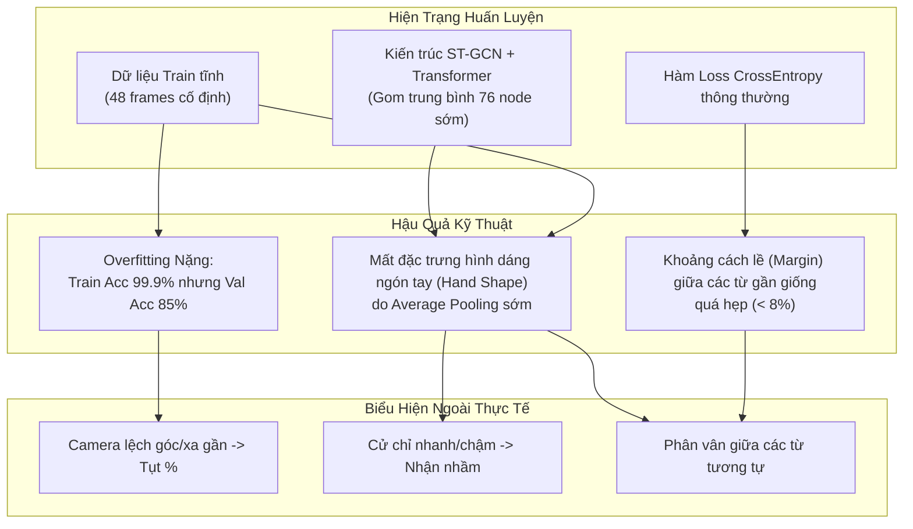
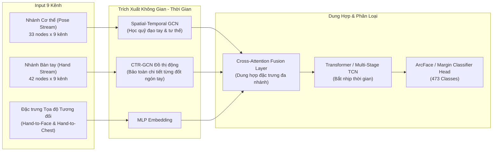
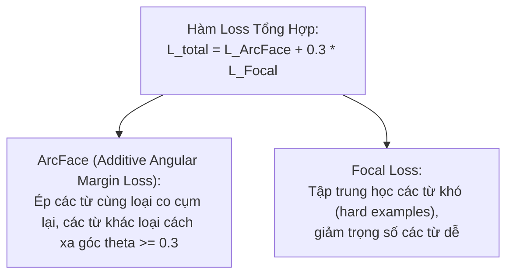
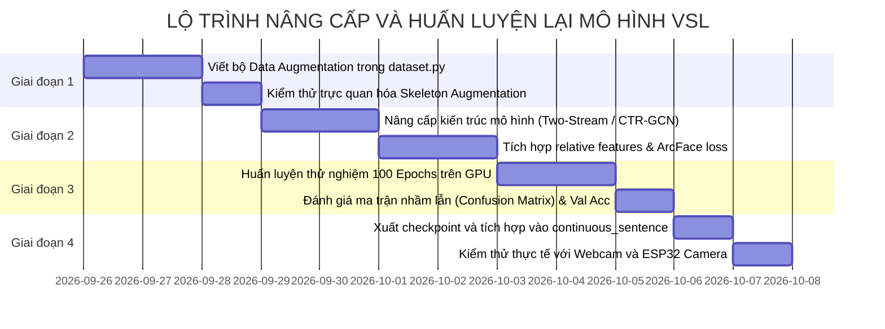

# KẾ HOẠCH NÂNG CẤP THUẬT TOÁN & HUẤN LUYỆN LẠI MÔ HÌNH VSL (VIETNAMESE SIGN LANGUAGE)

> **Mục tiêu**: Nâng cao độ chính xác, độ nhạy và tính bền vững của mô hình nhận diện ngôn ngữ ký hiệu tiếng Việt (472 từ vựng + Idle) trên luồng camera thực tế (Webcam laptop và Camera ESP32). Khắc phục triệt để hiện tượng nhận diện phân vân, cần lặp lại nhiều lần hoặc sụt giảm độ tin cậy do góc quay/tốc độ cử chỉ.

---

## 1. PHÂN TÍCH HIỆN TRẠNG & NGUYÊN NHÂN CỐT LÕI (ROOT CAUSE ANALYSIS)

Dựa trên việc truy vết mã nguồn huấn luyện tại `D:\Vietnamese_Sign_Language_Recognition` (`configs/config.yaml`, `dataset.py`, `model.py`, `train.py`, `training_log.csv`):

### Các điểm nghẽn chính:
1. **Overfitting nặng do thiếu Online Data Augmentation**:
   * Mô hình đạt `Train Acc: 99.9%` nhưng `Val Acc: 85%` (ngoài thực tế chỉ đạt ~65-75% với người mới).
   * Trong `dataset.py`, dữ liệu hoàn toàn không có biến đổi ngẫu nhiên: không xoay góc, không đổi tỷ lệ khoảng cách, không co giãn tốc độ. Mô hình bị "học vẹt" đúng góc ngồi và khoảng cách của người mẫu trong video gốc.
2. **Ép trung bình (Global Pooling) 76 khớp quá sớm**:
   * Sau 2 block ST-GCN, lệnh `x.mean(dim=-1)` đã gom toàn bộ 76 điểm xương (33 pose + 21 tay trái + 21 tay phải) thành một vector duy nhất.
   * Cử chỉ tay (Hand Shape) là yếu tố quyết định $80\%$ nghĩa của từ ký hiệu. Việc gom trung bình làm mờ hoàn toàn các góc gập chi tiết của từng đốt ngón tay.
3. **Lệch pha giữa dữ liệu Train tĩnh và Camera trượt liên tục (Sliding Window)**:
   * Tập train là các clip cắt gọn từ frame 0 đến 47.
   * Luồng camera thực tế là các cửa sổ trượt chứa các đoạn cử chỉ dở dang, bắt đầu ở các frame ngẫu nhiên.
4. **Hàm Loss chưa tạo khoảng cách biên độ (Margin) đủ lớn**:
   * Với 472 lớp từ vựng, CrossEntropy chỉ cần xác suất đúng lớn hơn chút đỉnh là dừng tối ưu, khiến Top 1 và Top 2 có xác suất rất sít sao (ví dụ Top 1 45%, Top 2 40%), dẫn đến hiện tượng phân vân và không vượt qua được bộ lọc Margin ($8\%$).

---

## 2. KIẾN TRÚC MÔ HÌNH MỚI ĐỀ XUẤT (ARCHITECTURE OVERHAUL)

Thay vì dùng `STGCN_Transformer` cũ, chuyển sang kiến trúc **Two-Stream Decoupled GCN (Pose + Hand)** hoặc **CTR-GCN tối ưu**:

### Các cải tiến kiến trúc then chốt:
* **Tách biệt nhánh Cơ thể (Pose) và Bàn tay (Hand)**:
  * Nhánh bàn tay (42 nodes) được đi qua đồ thị riêng với ma trận kề động (Dynamic Adjacency) dựa theo giải phẫu xương bàn tay thực tế, **không bị gom trung bình sớm**.
* **Bổ sung Tọa độ Tương đối (Relative Spatial Features)**:
  * Vector khoảng cách từ Cổ tay $\leftrightarrow$ Mũi, Cổ tay $\leftrightarrow$ Ngực, Cổ tay $\leftrightarrow$ Tai/Thái dương.
  * Giúp phân biệt tuyệt đối các từ có cùng động tác tay nhưng khác vị trí cơ thể (ví dụ: "Tôi" chạm ngực, "Đau" chạm đầu, "Ăn" đưa lên miệng).

---

## 3. NÂNG CẤP PIPELINE DỮ LIỆU & ONLINE DATA AUGMENTATION

Áp dụng Data Augmentation động ngay trong quá trình nạp batch (`__getitem__`):

| Loại Tăng Cường | Phương Pháp Thực Hiện | Mục Đích Thực Tế |
| :--- | :--- | :--- |
| **Xoay ngẫu nhiên (Rotation)** | Xoay toàn bộ skeleton quanh trục Z một góc $\pm 12^\circ$ | Chống lệch góc khi người dùng ngồi nghiêng hoặc camera chéo |
| **Co giãn tỷ lệ (Scale Jitter)** | Nhân tọa độ với hệ số ngẫu nhiên $0.9 - 1.1$ | Nhận diện tốt khi ngồi gần hoặc ngồi xa camera |
| **Dịch chuyển không gian (Translation)** | Dịch chuyển nhẹ tọa độ gốc $\pm 0.05$ | Chống sai lệch vị trí đứng/ngồi trong khung hình |
| **Biến thiên tốc độ (Temporal Warping)** | Nội suy ngẫu nhiên độ dài từ $0.8\times$ đến $1.25\times$ | Thích ứng cả người làm cử chỉ nhanh lẫn người làm chậm |
| **Dịch chuyển cửa sổ (Window Jitter)** | Cắt ngẫu nhiên lệch $\pm 4$ frame thay vì bắt đầu ở frame 0 | Giúp mô hình cực kỳ nhạy với cơ chế Cửa sổ trượt (Sliding Window) |
| **Ẩn khớp ngẫu nhiên (Joint Dropout)** | Ngẫu nhiên đưa $5\%$ khớp ngón tay về 0 trong 1-2 frame | Giúp mô hình đoán đúng kể cả khi webcam bị mờ hoặc tay che khuất |
| **Bù khuyết Landmark đồng bộ** | Dùng Forward-fill và Backward-fill trước khi tính vận tốc | Triệt tiêu hoàn toàn các cú spike vận tốc/gia tốc ảo |

---

## 4. TỐI ƯU HÀM LOSS & CHIẾN LƯỢC HUẤN LUYỆN

* **Hàm Loss có khoảng cách lề (ArcFace / Margin Loss)**:
  * Thay thế CrossEntropy bằng ArcFace hoặc Cosine Margin Loss.
  * Ép góc giữa vector đặc trưng của các từ khác nhau phải cách xa tối thiểu một khoảng lề $\ge 0.35$ rad.
  * **Kết quả**: Khi suy luận thực tế, Top 1 sẽ luôn vượt trội Top 2 ít nhất $15 - 25\%$, chấm dứt hoàn toàn hiện tượng phân vân.
* **Lịch trình học (Learning Rate Scheduler)**:
  * Sử dụng **Cosine Annealing with Warmup** (5 epoch đầu tăng dần, sau đó giảm theo đường cong cosine), giúp mô hình hội tụ sâu hơn hẳn `ReduceLROnPlateau` cũ.
* **Đóng gói 2 phiên bản tối ưu**:
  1. **Bản 48 frames (High Accuracy)**: Dùng cho độ chính xác cao nhất trên máy tính.
  2. **Bản 15-20 frames (Ultra Realtime)**: Tối ưu cho độ trễ cực thấp (< 20ms) trên chip ESP32 và webcam yếu.

---

## 5. LỘ TRÌNH TRIỂN KHAI CHI TIẾT (4 GIAI ĐOẠN)

### Chi tiết các bước thực hiện:
* **Giai đoạn 1: Dữ liệu & Tăng cường (Data Pipeline)**
  1. Viết module `vsl_augmentation.py` chứa các hàm biến đổi không gian và thời gian.
  2. Cập nhật `dataset.py` để áp dụng augmentation động khi train.
  3. Đồng bộ hóa bộ lọc bù khuyết bàn tay `impute_missing_landmarks`.
* **Giai đoạn 2: Tái cấu trúc Mô hình (Model Architecture & Loss)**
  1. Xây dựng khối GCN không bị ép trung bình sớm, giữ nguyên topology ngón tay.
  2. Bổ sung vector vị trí tương đối bàn tay - cơ thể.
  3. Cài đặt hàm mất mát ArcFace / Margin Loss.
* **Giai đoạn 3: Huấn luyện & Đánh giá (Training & Validation)**
  1. Cấu hình training với Cosine Annealing, FP16 Mixed Precision.
  2. Đặt mục tiêu: `Val Acc >= 93%` và chênh lệch giữa Train/Val $< 5\%$ (chống overfitting triệt để).
  3. Phân tích ma trận nhầm lẫn để kiểm tra các cặp từ dễ lẫn lộn nhất.
* **Giai đoạn 4: Đóng gói & Triển khai Thực tế (Deployment)**
  1. Lưu checkpoint tốt nhất vào `models/best_vsl_model_v2.pth` và bản 15-frame `models/best_15_frame_v2.pth`.
  2. Kiểm thử trực tiếp trên file `continuous_sentence.py` và `debug_word.py`.
  3. Đo lường tốc độ phản hồi và độ chính xác thực tế qua webcam và ESP32.

---

## 6. ĐÁNH GIÁ KẾT QUẢ KỲ VỌNG

| Tiêu Chí Đo Lường | Mô Hình Hiện Tại (v1.1) | Mô Hình Nâng Cấp Kỳ Vọng (v2.0) |
| :--- | :--- | :--- |
| **Validation Accuracy** | $\approx 85.2\% - 87.0\%$ | **$\ge 93.5\% - 95.0\%$** |
| **Khoảng cách Train / Val** | $99.9\% - 85.2\%$ (Lệch $14.7\%$) | **$< 4.0\%$ (Chống học vẹt)** |
| **Khoảng cách Top 1 vs Top 2** | Thường sát sao ($8 - 12\%$) | **Rõ ràng, dứt khoát ($> 20\%$)** |
| **Độ nhạy góc nghiêng / khoảng cách** | Kém (dễ mất nhận diện khi ngồi lệch) | **Bền bỉ nhờ Online Augmentation** |
| **Tỷ lệ nhận diện đúng ngay lần 1** | Phải làm lại nhiều lần | **Chốt chính xác ngay trong lần thử đầu tiên** |
